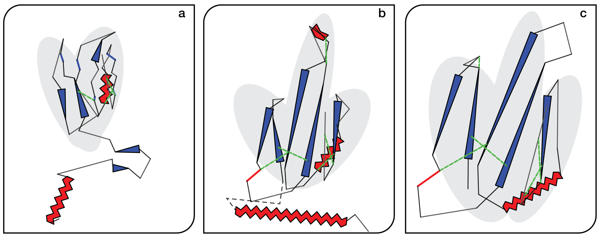
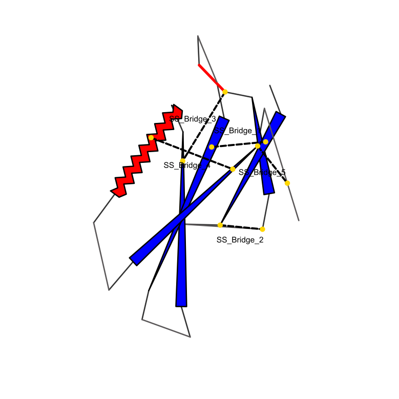
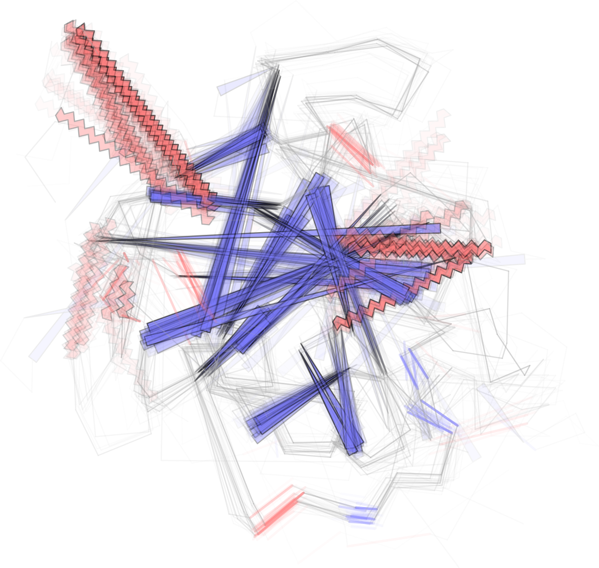

# FlatProt



FlatProt is a tool for 2D protein visualization aimed at improving the comparability of protein structures through standardized 2D visualizations. FlatProt focuses on creating highly comparable representations for same-family proteins. In this case FlatProt was used to generate comparable representations for 3 3FTx structures.

## Getting Started

FlatProt needs python version: python= ">=3.11,<=3.13"

### Download FlatProt via uv

We use and recommend [uv](https://github.com/astral-sh/uv) as a fast, reliable Python package installer and resolver.

```shell
# Install FlatProt using uv
uv tool add FlatProt
```

```shell
# Install FlatProt using uv
uvx flatprot
```

### Install Foldseek

Instructions for downloading the Foldseek software can be found in Foldseek's GitHub

-   [Foldseek GitHub](https://github.com/steineggerlab/foldseek)

--> FlatProt needs the path to the foldseek executable passed as argument to the main function to be used by the program.

### Install dssp

Instructions for downloading dssp can be found here:

-   [dssp instructions](https://pdb-redo.eu/dssp/download)

!The program runs on the mkdssp version 4.4.0! (some sources don't provide that (brew does!))

_An example download workflow for usage can also be found in the google colab_

## First experiences with Google Colab

For direct usage of FlatProt including all parameters the following Collabs provide functionalities for using FlatProt without locally downloading anything.
The runtime of the Colab is way longer than local usage. Therefore we don't advise using it for big amounts of data:

### UniProt ID Projection Example

[](https://colab.research.google.com/github/t03i/FlatProt/blob/notebooks/examples/uniprot_projection.ipynb)

This notebook demonstrates how to fetch a protein structure from the AlphaFold Database (AFDB) using a UniProt ID, run DSSP, and generate a FlatProt projection.

### Annotation and Style Example

[](https://colab.research.google.com/github/t03i/FlatProt/blob/notebooks/examples/annotations.ipynb)

This notebook demonstrates how to apply custom styles and various annotations (point, line, area) to a FlatProt projection.

### Same Family Alignment Example

[](https://colab.research.google.com/github/t03i/FlatProt/blob/notebooks/examples/3ftx_alignment.ipynb)

This notebook demonstrates aligning three related three-finger toxin structures (Cobra, Krait, Snake) using a Foldseek database and then projecting them into 2D SVG visualizations using FlatProt.

### Domain-Aligned Projection Example

[](https://colab.research.google.com/github/t03i/FlatProt/blob/notebooks/examples/chainsaw.ipynb)

Generate and compare different 2D SVG visualizations of a protein structure based on its domains: Normal Projection, Domain-Aligned Projection, Domain-Separated Projection.

### Compute Cystine Bridges Example

[](https://colab.research.google.com/github/t03i/FlatProt/blob/notebooks/examples/dysulfide.ipynb)

This notebook demonstrates how to: Compute cystine (disulfide) bridges from a protein structure file (`.cif`); Create a FlatProt annotation file (`.toml`) highlighting these bridges; Generate a 2D SVG projection of the protein using `flatprot project`, applying the annotations.

### Family Overlay Example

[](https://colab.research.google.com/github/t03i/FlatProt/blob/notebooks/examples/klk_overlay.ipynb)

This example script demonstrates how to align KLK (Kallikrein) structures and overlay their FlatProt projections.

## Documentation

FlatProt's documentation can found here:

-   [FlatProt documentation!](https://t03i.github.io/FlatProt/)

The documentation includes:

-   Detailed CLI usage instructions
-   File format specifications
-   API reference

**important notes:**

-   input PDB files need a header to work (important for predicted structures)
-   FlatProt's methods can be used via command line commands (cli)

## Contributing

We welcome contributions to FlatProt! If you'd like to contribute, please follow these steps:

1.  **Fork the repository:** Create your own fork of the FlatProt repository on GitHub.
2.  **Create a branch:** Make your changes in a dedicated branch in your fork.
3.  **Submit a pull request:** Open a pull request from your branch to the `staging` branch of the t03i/FlatProt repository.

Please ensure your contributions adhere to the project's coding style and include tests where appropriate. For major changes, please open an issue first to discuss what you would like to change.

See [CONTRIBUTING.md](CONTRIBUTING.md) for more detailed guidelines.

## Data

This project uses datasets that can be found on Zenodo.

[Zenodo Data](https://doi.org/10.5281/zenodo.15264810)

## Example visualizations





## Reference

If you use FlatProt in your research, please cite:

> FlatProt: 2D visualization eases protein structure comparison
> Tobias Olenyi, Constantin Carl, Tobias Senoner, Ivan Koludarov, Burkhard Rost
> bioRxiv 2025.04.22.650077; doi: https://doi.org/10.1101/2025.04.22.650077

## License

FlatProt is licensed under the Apache License 2.0. See the [LICENSE](LICENSE) file for more details.
